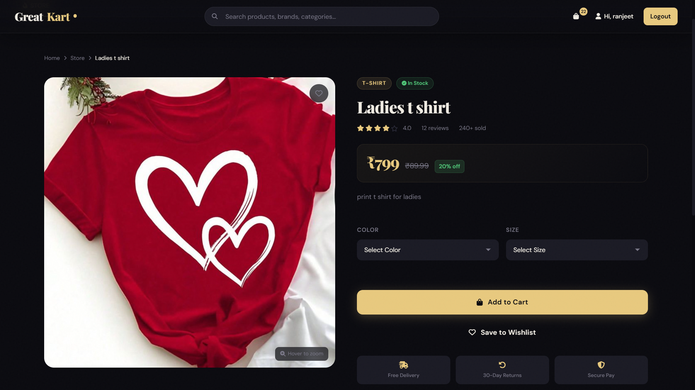
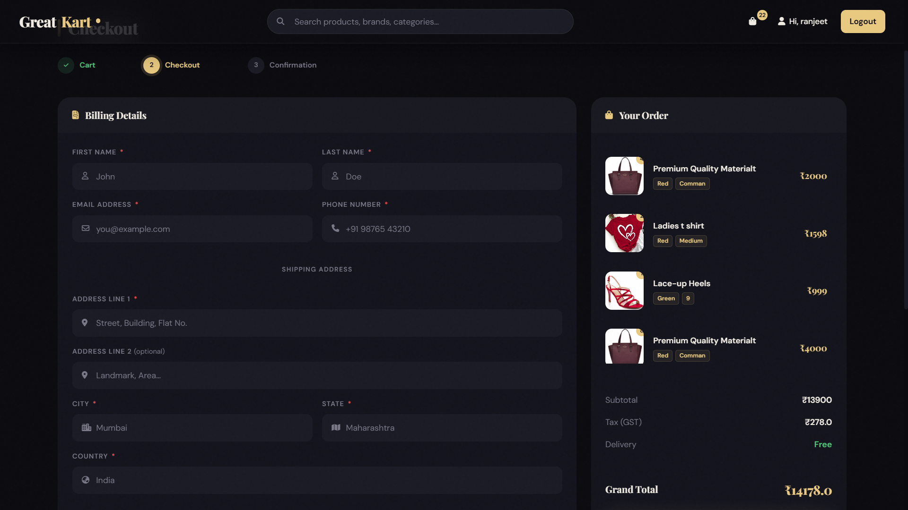
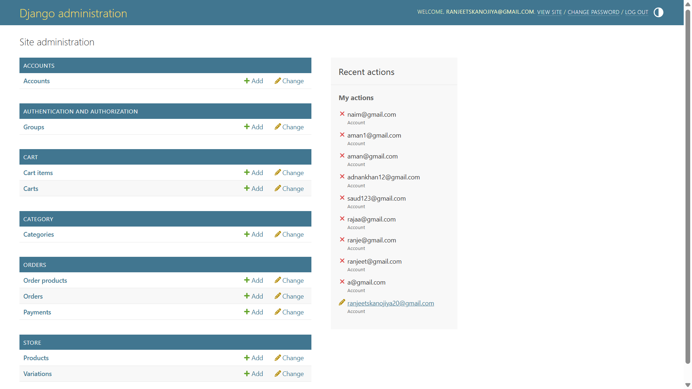

# GreatKart — Django E-commerce Project

A simple Django-based e-commerce application built as a learning/project showcase. The repository contains multiple Django apps (accounts, store, cart, orders, category, search, etc.), templates and static assets. This README documents how to set up, run, and extend the project, and where to add screenshots.

---

## Table of Contents

- Project overview
- Features
- Tech stack
- Project structure
- Requirements
- Setup / Installation
- Environment variables
- Database & migrations
- Static files & media
- Running the project
- Screenshots (where to add)
- Tests (if any)
- Contributing
- License

---

## Project overview

GreatKart is a Django e-commerce project intended to demonstrate a full-stack e-commerce flow: product listing, categories, search, cart management, orders, user accounts, and basic admin management.

## Features

- Product listing and categories
- Product detail pages
- Add to cart, update cart, remove from cart
- Checkout and order creation
- User authentication (sign up / login)
- Admin interface for managing products, categories, and orders
- Basic search functionality

## Tech stack

- Python (Django)
- SQLite (db.sqlite3 is included for development)
- HTML, CSS, JavaScript for frontend templates

## Project structure (important directories)

- accounts/ — user authentication app
- cart/ — shopping cart logic
- category/ — product categories
- store/ — main product store app
- orders/ — order processing
- search/ — search implementation
- greatcard/ and greatkart_template/ — templates and example pages
- static/, staticfiles/ — static assets (CSS/JS/images)
- media/ — uploaded media (product images)
- db.sqlite3 — development database (SQLite)
- manage.py — Django management script

## Requirements

Install dependencies from requirements.txt (recommended to use a virtualenv):

```bash
pip install -r requirements.txt
```

## Environment variables

Create a `.env` file in the project root (this repo contains a `.env` directory placeholder). Typical variables you may need:

- SECRET_KEY=your_django_secret_key
- DEBUG=True
- ALLOWED_HOSTS=localhost,127.0.0.1
- DATABASE_URL (if not using default sqlite)

Adjust settings.py to load from environment variables if not already configured.

## Database & migrations

If you want to use the included SQLite DB (`db.sqlite3`), you can skip migrations. To create a fresh DB and run migrations:

```bash
python manage.py makemigrations
python manage.py migrate
```

Create a superuser for admin access:

```bash
python manage.py createsuperuser
```

## Static files & media

Collect static files for production or to serve static in a single location:

```bash
python manage.py collectstatic
```

Make sure `MEDIA_ROOT` and `STATIC_ROOT` are set in `settings.py` when deploying.

## Running the project (development)

Activate your environment, install requirements, then run:

```bash
python manage.py runserver
```

Open http://127.0.0.1:8000/ in your browser.

## Screenshots (where to add)

Add screenshots to the repository under a dedicated folder for documentation, for example `docs/screenshots/` or `assets/screenshots/`. Use descriptive filenames. Below are recommended screenshots and the exact file names and README insertion points.

1. Home / Landing page
   - Path: `docs/screenshots/home.png`
   - Insert right after the Project overview (Example markdown):
     ```markdown
     
     ```
2. Product listing / category page
   - Path: `docs/screenshots/product-list.png`
   - Insert in the Features section or a UI subsection:
     ```markdown
     
     ```
3. Product detail page
   - Path: `docs/screenshots/product-detail.png`
   - Insert near Product detail description:
     ```markdown
     
     ```
4. Cart page
   - Path: `docs/screenshots/cart.png`
   - Insert in Cart / Checkout section:
     ```markdown
     
     ```
5. Checkout / Order confirmation
   - Path: `docs/screenshots/checkout.png`
   - Insert in Orders / Checkout section:
     ```markdown
     
     ```
6. Admin dashboard (optional)
   - Path: `docs/screenshots/admin.png`
   - Insert in an Admin subsection:
     ```markdown
     
     ```

Notes:
- To add these screenshots to the repo, create the folder `docs/screenshots/` and upload the image files (PNG/JPG). Commit them to the repository.
- If you prefer to keep images in `static/` or `media/`, update the paths in the markdown accordingly.

## Tests

If you have tests, document how to run them. Example:

```bash
python manage.py test
```

(If there are no tests, you can add this section later.)

## Contributing

Contributions are welcome. Steps to contribute:

1. Fork the repository
2. Create a feature branch: `git checkout -b feat/my-feature`
3. Commit your changes and push
4. Open a Pull Request describing your changes

Please include tests and update the README if you add or change features.

## Notes about database file

This repo contains `db.sqlite3` for convenience. Remove or replace it before deploying to production or publishing sensitive data.

## License

Add a license (e.g., MIT) or include the repository's license file.

---

If you'd like, I can also create the `docs/screenshots/` folder and add placeholder image files (empty .gitkeep or sample PNG). Tell me if you want me to commit those as well.
